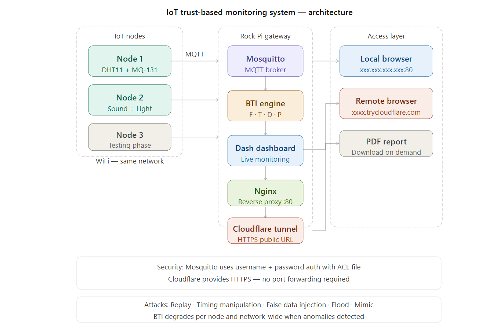
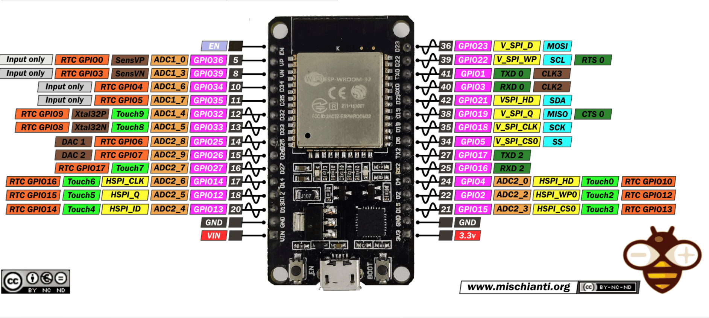
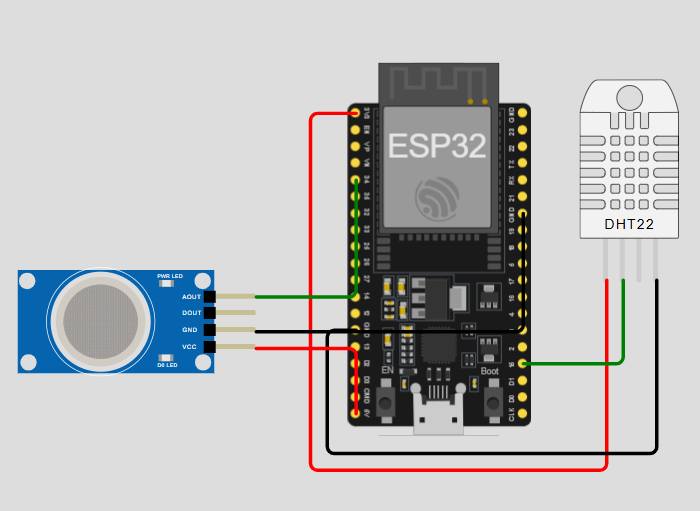
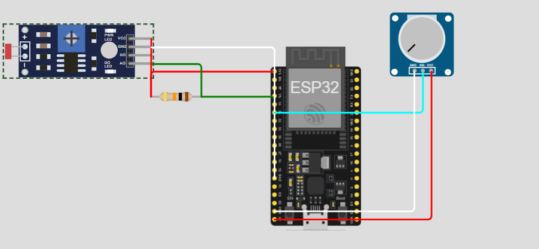

# 4165489
 
# Evaluating Trust-Based Robustness in Heterogeneous IoT Networks
 
---
 
## Abstract
 
The Internet of Things (IoT) relies on continuous communication between heterogeneous and resource-constrained devices, making it highly susceptible to cyber threats. Behaviour-based trust scoring has emerged as a promising approach for dynamically evaluating device reliability beyond static authentication mechanisms. However, existing work often assumes that behavioural metrics are inherently trustworthy and resistant to adversarial manipulation.
 
This study investigates the robustness of behaviour-based trust scoring under communication-level attacks in IoT environments. A hardware-based testbed is developed using ESP32 sensor nodes and a Rock Pi gateway, where device behaviour is monitored and evaluated using a Behavioural Trust Index (BTI). Controlled adversarial scenarios — including replay attacks, timing manipulation, and false data injection — are introduced to assess whether trust scores can be influenced by protocol-compliant malicious behaviour.
 
**Keywords:** Internet of Things, IoT Security, Trust Management, Behaviour-Based Trust, Anomaly Detection, Adversarial Attacks, MQTT, Embedded Systems
 
---
 
## Project Overview
 
This repository contains the full implementation of the experimental IoT testbed developed for this Honours research project. The system integrates real-time MQTT communication, behavioural monitoring, dynamic trust computation, secure deployment infrastructure, and IoT device connectivity within a unified framework.
 
The system evaluates node trustworthiness using a **Behavioural Trust Index (BTI)** computed from four observable communication metrics: message frequency (F), inter-arrival timing (T), sensor data stability (D), and packet size consistency (P). These are aggregated into a per-node trust score and a network-wide score, with controlled adversarial scenarios used to evaluate the resilience of the BTI under realistic attack conditions.
 
---
 
## System Architecture
 

 
```
ESP32 Node 1 (DHT11 + MQ-131)  ──┐
ESP32 Node 2 (Sound + Light)   ──┤──► Mosquitto MQTT Broker (Rock Pi Gateway)
ESP32 Node 3 (Testing/Future)  ──┘         │
                                            ▼
                                 Dash-based Monitoring Dashboard
                                 BTI Computation Engine
                                 PDF Report Generation
                                            │
                               ┌────────────┴────────────┐
                               ▼                         ▼
                     Nginx Reverse Proxy        Cloudflare Tunnel
                     Local network access       Secure remote access
```
 
---
 
## BTI Model
 
The Behavioural Trust Index aggregates observable communication metrics into a continuous trust score per device:
 
```
BTI = w1·F + w2·T + w3·D + w4·P
```
 
Where:
- **F** — Message frequency consistency
- **T** — Inter-arrival timing consistency
- **D** — Sensor data stability
- **P** — Packet size consistency
Weights satisfy: w1 + w2 + w3 + w4 = 1
 
To account for temporal behaviour and reduce the influence of outdated observations, a trust decay mechanism is applied via exponential smoothing:
 
```
BTI(t) = α · BTI(t-1) + (1 - α) · CurrentScore
```
 
| Parameter | Value | Description |
|-----------|-------|-------------|
| α (alpha) | 0.7 | Smoothing factor — controls trust decay rate |
| w1 | 0.25 | Weight for Frequency (F) |
| w2 | 0.30 | Weight for Timing (T) |
| w3 | 0.25 | Weight for Data consistency (D) |
| w4 | 0.20 | Weight for Payload structure (P) |
 
### BTI Thresholds
 
| Score | Status | Colour |
|-------|--------|--------|
| 0.7 – 1.0 | Stable — no anomaly | Green |
| 0.4 – 0.7 | Moderate instability | Yellow |
| 0.0 – 0.4 | Critical trust degradation | Red |
 
---
 
## Adversarial Scenarios
 
The following protocol-compliant attacks are evaluated against the BTI framework:
 
| Attack | Behavioural Change | Expected Effect | Risk Level |
|--------|-------------------|-----------------|------------|
| Replay Attack | Repeated valid messages | May maintain high trust | Medium |
| Timing Manipulation | Slight delay variation | Minor trust degradation | High |
| False Data Injection | Incorrect sensor values | Affects data stability (D) | High |
| Traffic Flooding | Increased frequency | Distorts metric F | Medium |
| Mimic Attack | Matches normal patterns | Trust remains high | Critical |
 
---
 
## Hardware
 
### Rock Pi 4SE (Central Gateway)
- Runs Mosquitto MQTT broker
- Runs the Python Dash monitoring dashboard
- Hosts Nginx reverse proxy and Cloudflare Tunnel
- Acts as the network gateway for all IoT nodes
---
 
### ESP32 Board — ESP32-WROOM-32 DevKit V1
 
All nodes use the ESP32-WROOM-32 DevKit V1 (38-pin). Key pins used in this project:
 

 
> Note: **3.3V is on the bottom RIGHT** and **VIN (5V) is on the bottom LEFT** of the board — they are on opposite sides.
 
---
 
### ESP32 Node 1 — DHT11 + MQ-131
 

 
> **Schematic note:** The diagram above uses a **DHT22** and **MQ-2** as visual stand-ins due to component availability in the simulation tool (Wokwi). The actual hardware uses a **DHT11** (temperature + humidity) and **MQ-131** (ozone sensor). Wiring is identical for both substitutions. The ESP32 board model shown also differs visually — actual board is the ESP32-WROOM-32 DevKit V1 shown above.
 
```
ESP32 Pin    Sensor        Notes
─────────────────────────────────────────────────────
3.3V     →   DHT11 VCC     3.3V — bottom RIGHT of board
GND      →   DHT11 GND     Ground
GPIO 4   →   DHT11 DATA    Digital signal
VIN      →   MQ-131 VCC    5V — bottom LEFT of board (MUST be 5V)
GND      →   MQ-131 GND    Ground
GPIO 34  →   MQ-131 AOUT   Analog signal (input only pin)
```
 
> MQ-131 requires 5V power via the VIN pin and a 60-second warmup period before readings are reliable. GPIO 34 is input-only on the ESP32-WROOM-32 — correct for analog reads.
 
---
 
### ESP32 Node 2 — Sound + Light
 

 
> **Schematic note:** The diagram above uses an **LDR module** and a **potentiometer** as stand-ins for the light and sound sensors due to component availability in Wokwi. The LDR module represents the light sensor and the potentiometer represents the sound sensor analog output. The resistor shown is part of the LDR voltage divider circuit. Actual hardware uses a generic analog sound module and a generic analog light/LDR module. Wiring connections are identical.
 
```
ESP32 Pin    Sensor        Notes
──────────────────────────────────────────────────────
3.3V     →   Sound VCC     3.3V — bottom RIGHT of board
GND      →   Sound GND     Ground
GPIO 35  →   Sound AOUT    Analog signal (input only pin)
3.3V     →   Light VCC     3.3V — bottom RIGHT of board
GND      →   Light GND     Ground
GPIO 32  →   Light AOUT    Analog signal
```
 
> Both sensors operate on 3.3V — safe for all ESP32 GPIO pins. GPIO 35 is input-only on the ESP32-WROOM-32 — correct for analog reads.
 
---
 
### ESP32 Node 3
- Currently in testing phase — sensor selection pending
- Publishes heartbeat data (uptime, IP, RSSI) for network presence validation
- Future implementation will include adversarial firmware for attack simulation
- No wiring required — USB power only
---
 
## Software Requirements
 
### Rock Pi (Python)
 
```bash
sudo apt install python3-numpy python3-matplotlib python3-reportlab
pip3 install dash paho-mqtt
```
 
Or use the requirements file:
```bash
pip3 install -r requirements.txt
```
 
`requirements.txt`:
```
dash
paho-mqtt
numpy
matplotlib
reportlab
```
 
### Arduino IDE (ESP32-WROOM-32 DevKit V1)
 
Install via **Sketch → Include Library → Manage Libraries**:
 
| Library | Author |
|---------|--------|
| PubSubClient | Nick O'Leary |
| DHT sensor library | Adafruit |
| Adafruit Unified Sensor | Adafruit |
| ArduinoJson | Benoit Blanchon |
 
Install the ESP32 board:
 
1. Open **File → Preferences**
2. Add this URL to Additional Boards Manager URLs:
   ```
   https://raw.githubusercontent.com/espressif/arduino-esp32/gh-pages/package_esp32_index.json
   ```
3. Go to **Tools → Board → Boards Manager**
4. Search `esp32` and install **esp32 by Espressif Systems**
5. Select: **Tools → Board → ESP32 Arduino → ESP32 Dev Module**
6. Set upload settings:
   - Upload Speed: `115200`
   - Flash Frequency: `80MHz`
   - Flash Mode: `QIO`
   - Partition Scheme: `Default 4MB with spiffs`
> When installing DHT sensor library, click **Install All** when prompted — this installs Adafruit Unified Sensor automatically.
 
---
 
## MQTT Broker Setup (Mosquitto)
 
### Install
```bash
sudo apt install mosquitto mosquitto-clients
```
 
### Configuration `/etc/mosquitto/mosquitto.conf`
```
pid_file /run/mosquitto/mosquitto.pid
persistence true
persistence_location /var/lib/mosquitto/
log_dest file /var/log/mosquitto/mosquitto.log
log_type all
listener 1883
protocol mqtt
listener 9001
protocol websockets
allow_anonymous false
password_file /etc/mosquitto/passwd
acl_file /etc/mosquitto/acl
```
 
The broker supports:
- Standard MQTT communication over port 1883
- WebSocket-based MQTT over port 9001
- Real-time topic subscription and message distribution
- Multiple concurrent client connections
### Create MQTT user
```bash
sudo mosquitto_passwd -c /etc/mosquitto/passwd esp32user
```
 
### ACL file `/etc/mosquitto/acl`
```
user esp32user
topic #
 
user device01
topic #
 
user dashboard
topic #
```
 
### Restart and verify
```bash
sudo systemctl restart mosquitto
sudo systemctl status mosquitto
```
 
### Test connection
```bash
# Terminal 1 — subscribe
mosquitto_sub -h localhost -u esp32user -P yourpassword -t "iot/#" -v
 
# Terminal 2 — publish test message
mosquitto_pub -h localhost -u esp32user -P yourpassword -t "iot/node1/data" \
  -m '{"node":"node1","temp":25,"humidity":60,"ozone":100,"ip":"xxx.xxx.xxx.xxx","rssi":-50}'
```
 
---
 
## MQTT Topic Structure
 
| Topic | Direction | Description |
|-------|-----------|-------------|
| `iot/node1/data` | Node → Broker | Node 1 sensor readings |
| `iot/node2/data` | Node → Broker | Node 2 sensor readings |
| `iot/node3/data` | Node → Broker | Node 3 heartbeat |
| `iot/nodeX/command` | Broker → Node | Commands to a node (e.g. PING) |
| `iot/network/status` | Node → Broker | Node online/offline announcements |
 
The dashboard subscribes to `iot/#` — any new node publishing to `iot/nodeX/data` appears automatically without code changes.
 
---
 
## Running the Dashboard
 
### Start the app
```bash
python3 app.py
```
 
Access locally at:
```
http://YOUR_ROCK_PI_IP:5000
```
 
---
 
## Nginx Reverse Proxy
 
Nginx routes incoming HTTP requests on port 80 to the internal Dash monitoring application, providing clean local access without specifying a port.
 
### Install
```bash
sudo apt install nginx
```
 
### Configuration `/etc/nginx/sites-available/iot-dashboard`
```nginx
server {
    listen 80;
    server_name _;
 
    location / {
        proxy_pass http://127.0.0.1:5000;
        proxy_http_version 1.1;
        proxy_set_header Upgrade $http_upgrade;
        proxy_set_header Connection "upgrade";
        proxy_set_header Host $host;
        proxy_set_header X-Real-IP $remote_addr;
        proxy_read_timeout 86400;
    }
}
```
 
### Enable and start
```bash
sudo ln -s /etc/nginx/sites-available/iot-dashboard /etc/nginx/sites-enabled/
sudo nginx -t
sudo systemctl restart nginx
sudo systemctl enable nginx
```
 
Access via:
```
http://YOUR_ROCK_PI_IP
```
 
---
 
## Cloudflare Tunnel (Secure Remote Access)
 
Cloudflare Tunnel securely exposes the local IoT monitoring system to external networks without requiring direct port forwarding or public IP exposure. This simulates a realistic cloud-connected IoT environment while maintaining secure access to the experimental system.
 
### Install cloudflared
```bash
# For ARM64 (aarch64)
wget https://github.com/cloudflare/cloudflared/releases/latest/download/cloudflared-linux-arm64.deb
sudo dpkg -i cloudflared-linux-arm64.deb
 
# For ARM 32-bit (armv7l)
wget https://github.com/cloudflare/cloudflared/releases/latest/download/cloudflared-linux-arm.deb
sudo dpkg -i cloudflared-linux-arm.deb
```
 
Check your architecture:
```bash
uname -m
# aarch64 = use arm64
# armv7l  = use arm
```
 
### Quick tunnel (temporary public URL)
```bash
cloudflared tunnel --url http://localhost:5000
# or if running from download directory
./cloudflared tunnel --url http://localhost:5000
```
 
This provides a temporary HTTPS URL:
```
https://xxxx-xxxx-xxxx.trycloudflare.com
```
 
### Persistent named tunnel
```bash
cloudflared tunnel login
cloudflared tunnel create iot-dashboard
cloudflared tunnel route dns iot-dashboard yourdomain.com
cloudflared tunnel run iot-dashboard
```
 
### Run as a service
```bash
sudo cloudflared service install
sudo systemctl start cloudflared
sudo systemctl enable cloudflared
```
 
The deployment provides:
- HTTPS-encrypted communication
- Secure remote dashboard accessibility
- Protection of internal network addresses
- Simplified external connectivity for evaluation and demonstration
---
 
## Full Startup Sequence
 
```bash
# 1. Start MQTT broker
sudo systemctl start mosquitto
 
# 2. Start dashboard
python3 app.py &
 
# 3. Start Nginx
sudo systemctl start nginx
 
# 4. Start Cloudflare tunnel
cloudflared tunnel --url http://localhost:5000
```
 
### Auto-start on boot
 
Enable services:
```bash
sudo systemctl enable mosquitto
sudo systemctl enable nginx
sudo systemctl enable cloudflared
```
 
Create a systemd service for the Python app `/etc/systemd/system/iot-dashboard.service`:
```ini
[Unit]
Description=IoT Trust Monitoring Dashboard
After=network.target mosquitto.service
 
[Service]
User=dreamx
WorkingDirectory=/home/dreamx/
ExecStart=/usr/bin/python3 /home/dreamx/app.py
Restart=always
 
[Install]
WantedBy=multi-user.target
```
 
Enable it:
```bash
sudo systemctl daemon-reload
sudo systemctl enable iot-dashboard
sudo systemctl start iot-dashboard
```
 
---
 
## Configuration
 
Update these values in each ESP32 sketch before flashing:
 
```cpp
#define WIFI_SSID    "YOUR_WIFI_NAME"
#define WIFI_PASS    "YOUR_WIFI_PASSWORD"
#define MQTT_BROKER  "YOUR_ROCK_PI_IP"
#define MQTT_USER    "esp32user"
#define MQTT_PASS    "YOUR_MQTT_PASSWORD"
```
 
Update in `app.py`:
```python
MQTT_USER = "esp32user"
MQTT_PASS = "YOUR_MQTT_PASSWORD"
```
 
---
 
## Project Structure
 
```
├── app.py                  # Main dashboard and BTI computation engine
├── README.md               # This file
├── requirements.txt        # Python dependencies
├── SCHEMATIC.txt           # Text-based wiring reference
├── images/
│   ├── architecture.png    # Full system architecture diagram
│   ├── esp32.png           # ESP32-WROOM-32 pinout reference
│   ├── node1.png           # Node 1 wiring schematic (Wokwi)
│   └── node2.png           # Node 2 wiring schematic (Wokwi)
├── arduino/
│   ├── node1/              # DHT11 + MQ-131 firmware
│   ├── node2/              # Sound + Light firmware
│   └── node3/              # Testing node — sensor TBD
```
 
---
 
## Current Implementation Status
 
The following components have been successfully implemented and tested:
 
- MQTT communication infrastructure (Mosquitto broker)
- Dash-based behavioural monitoring dashboard
- Real-time MQTT message processing
- Behavioural Trust Index (BTI) computation engine
- Sliding-window behavioural analysis
- Exponential smoothing trust decay
- Nginx reverse proxy configuration
- Secure Cloudflare Tunnel deployment
- ESP32 Node 1 and Node 2 device communication
- PDF-based monitoring report generation
- Simulated attack injection controls
### Remaining Phases
 
- Full sensor integration on all nodes
- Development of adversarial ESP32 firmware
- Replay attack implementation
- Timing manipulation experiments
- False data injection scenarios
- Traffic flooding experiments
- Behaviour-mimicking attack evaluation
- Trust robustness analysis and experimental data collection
---
 
## Academic Context
 
This project is submitted in partial fulfilment of the requirements for the Honours degree in Computer Science at the University of the Western Cape. It demonstrates:
 
- IoT network trust evaluation using behavioural metrics
- Real-time monitoring with multi-node MQTT communication
- Attack detection and simulation in IoT environments
- Secure broker configuration with authentication and ACL
- Dynamic dashboard design for scalable node monitoring
- Network deployment using Nginx reverse proxy and Cloudflare tunnelling
- Empirical evaluation of trust scoring as a potential attack surface
---
 
## Author
 
**Lavhelani Mano**
Student Number: 4165489
Email: 4165489@myuwc.ac.za
Honours Project — University of the Western Cape
Department of Computer Science
